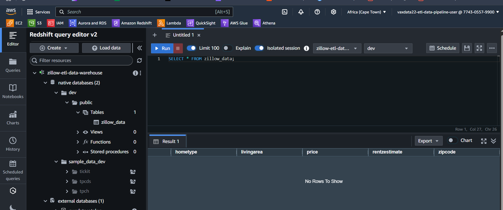

# Zillow Rapid API end-to-end ETL data pipeline by Airflow on EC2
This is an end-to-end AWS Cloud ETL project. This data pipeline orchestration uses Apache Airflow on AWS EC2 as well as AWS Lambda. 
It demonstrates how to build ETL data pipeline that would perform data transformation using Lambda function as well as loading into a Redshift cluster table. 
The data would then be visualized using Amazon QuickSight.
<br><br>


<br><br>

## GENERAL OVERVIEW OF PROJECT
This is an end-to-end AWS Cloud ETL project. This data pipeline orchestration uses Apache Airflow on AWS EC2 as well as AWS Lambda. 
It demonstrates how to build an ETL data pipeline that would perform data transformation using Lambda function as well as loading into a Redshift cluster table. 
The data would then be visualized by connecting Amazon QuickSight to the Redshift data warehouse.

This data engineering project demonstrates how to build and automate a Python ETL process that would extract real estate properties data from Zillow Rapid API, load it into an Amazon S3 bucket landing zone which then triggers a series of Lambda functions that ultimately transforms the data, converts into a CSV file format and load the data into another S3 bucket using Apache Airflow. 

Apache Airflow will utilize an `S3KeySensor` operator to monitor if the transformed data has been uploaded into the S3 bucket before attempting to load the data into a prepared Amazon Redshift data warehouse.
After the data is loaded into AWS Redshift, a connection would be made from Amazon QuickSight to the Redshift cluster to then visualize the Zillow (Rapid API) data. 

Apache Airflow is an open-source platform used for orchestrating and scheduling workflows of tasks and data pipelines. 
This project will entirely be carried out on AWS cloud platform. 

Overall, the project shows how to install Apache Airflow from scratch and schedule the ETL pipeline. It also shows how to use a sensor in the ETL pipeline. 
In addition, it shows how to setup AWS Lambda function from scratch, set up AWS Redshift and AWS QuickSight.

The project was inspired by Dr Yemi Olanipekun, whose tutorials benefitted me a lot.
<br><br>

## PROJECT REQUIREMENTS
1. Fundamental knowledge of SQL, Python, CSV/JSON, AWS Cloud, Apache Airflow, DW & ETL concepts

2. Familiarity with fundamentals Amazon Redshift data warehouse and AWS Lambda functions

3. Rapid API free account with API key (to serve as the source of the Zillow real estate properties data)

4. AWS EC2 instance with at least 4 GB memory (t3.medium) Ubuntu; and AWS S3 bucket as Data Lake
  
5. Code Editor (I used VSCode) for connecting to EC2 instance to create code (DAG file) on Airflow
  
6. Apache Airflow for orchestration (authoring of the ETL workflow via DAG) & services connections

7. Good knowledge and skills in data analytics and visualization on Amazon QuickSight tool
  
8. Perseverance to troubleshoot and resolve errors and failures, read logs, rebuild components, etc
<br><br>

## STEPS OF THE WORKFLOW
The following account of the project development process is not enough to enable the reader code along or replicate the whole process from start to finish. 
For instance, there is no detailing of the steps involved in creating accounts with Rapid API and Amazon AWS. 
There is also no detailing of the steps in creating an IAM User and creating the required IAM Roles that would later be used by EC2 and Lambda, setting up the S3 buckets, deploying the Lambda functions along with their IAM Role, setting up Redshift data warehouse cluster and connecting QuickSight to it, spinning up the AWS EC2 instance from scratch and preparing it to work with Airflow (Firewall settings for HTTP/HTTPS/SSH and attaching the IAM Role), connecting VSCode to the EC2 instance, as well as accessing Airflow via web browser.

However a person who is knowledgeable in Data Engineering skills should be familiar with how these are set up. 
By the way the reader who is not knowledgeable in these areas is hereby encouraged to do their own research, enroll in a Data Engineering bootcamp or learn from data engineering tutorials available online on some websites or some great channels on YouTube  (such as Tuple Spectra), or reach out to me for clarification. 
With that out of the way, let’s go over the key steps in this project.

Having satisfied all the 8 requirements in the preceding section, I proceeded to carry out the following setup:
<br><br>

### STEP 1: Zillow Rapid API set up:
Signed up for Rapid API account at https://rapidapi.com/hub/. 
The Zillow real estate data source used was the one provided by Sabri in this page: https://rapidapi.com/s.mahmoud97/api/zillow56/. 
This data source would be probed further in a later step.


<br><br>

### STEP 2: AWS IAM User account:
This account was created to be part of a User Group that has `AdministratorAccess`. 
The IAM User account has the following details:
* Username: `vaxdata22-etl-data-pipeline-user`
  
* Region: Africa (Cape Town) i.e. `af-south-1` (all AWS services such as S3, Lambda, Redshift, and QuickSight in this project would use this same region)
  
* Other notable details being the IAM User “Password”, the “Access Key”, and “Secret Access Key”.


<br><br>

### STEP 3: Creating the S3 Buckets:
Three S3 buckets were created with default settings.
* Bucket 1 name: ` zillow-etl-data-pipeline-raw-data-bucket`

* Bucket 2 name: `zillow-etl-data-pipeline-copy-data-bucket`

* Bucket 3 name: `zillow-etl-data-pipeline-clean-data-bucket`


<br><br>


<br><br>


<br><br>


<br><br>

### STEP 4: AWS IAM Roles:
Two important IAM Roles were needed:
1) For EC2 to have access to S3 and Redshift: `ec2-access-to-s3-and-redshift-role`
  
2) For Lambda to have access to S3 and CloudWatch Logs: `lambda-access-to-s3-and-cloudwatch-role`


<br><br>

### STEP 5: Deploying the Lambda functions:
The orchestration would make use of two Lambda functions:

#### The 1st Lambda function:
* Name: `move-raw-data-s3-to-copy-data-s3-function`

* Source bucket: `zillow-etl-data-pipeline-raw-data-bucket`

* Destination bucket: `zillow-etl-data-pipeline-copy-data-bucket`

This first Lambda function would simply copy the JSON file from the source bucket to the destination bucket.
The Python code for this Lambda function is pretty much straightforward. 
See the code [here](codes/move-raw-data-s3-to-copy-data-s3-function.py).


<br><br>

#### The 2nd Lambda function:
* Name: `transform-copy-data-s3-to-clean-data-s3-function`

* Source bucket: `zillow-etl-data-pipeline-copy-data-bucket`

* Destination bucket: `zillow-etl-data-pipeline-clean-data-bucket`

This second Lambda function would perform the data transformation on the JSON file in the source bucket and dump the resulting CSV file in the destination bucket.
In order to write the code, the response data from an API call was examined in the Rapid API dashboard.
See the “prettified” JSON response file [here](codes/zillow_api_response_data.json).
The file contains lots of records however the first record in the file is in the form:
```
{
  "results": [
    {
      "bathrooms": 3,
      "bedrooms": 3,
      "city": "Houston",
      "country": "USA",
      "currency": "USD",
      "datePriceChanged": 1741075200000,
      "daysOnZillow": -1,
      "homeStatus": "FOR_SALE",
      "homeStatusForHDP": "FOR_SALE",
      "homeType": "SINGLE_FAMILY",
      "imgSrc": "https://photos.zillowstatic.com/fp/b863449730ccf739abc992c4d7994f02-p_e.jpg",
      "isFeatured": false,
      "isNonOwnerOccupied": true,
      "isPreforeclosureAuction": false,
      "isPremierBuilder": false,
      "isShowcaseListing": true,
      "isUnmappable": false,
      "isZillowOwned": false,
      "latitude": 29.72605,
      "listing_sub_type": {
        "is_newHome": true
      },
      "livingArea": 2078,
      "longitude": -95.59101,
      "lotAreaUnit": "sqft",
      "lotAreaValue": 3049.2,
      "newConstructionType": "BUILDER_SPEC",
      "price": 499999,
      "priceChange": -36001,
      "priceForHDP": 499999,
      "priceReduction": "$36,001 (Mar 4)",
      "rentZestimate": 3657,
      "shouldHighlight": false,
      "state": "TX",
      "streetAddress": "3221 Royal Oaks Hollow Ln",
      "taxAssessedValue": 64900,
      "timeOnZillow": 4057545000,
      "zestimate": 491900,
      "zipcode": "77082",
      "zpid": 339418728
    },
…
]
}
```

It was observed that there were 38 fields per record. For this project, the fields of interest are the following 9 fields: `bathrooms`, `bedrooms`, `city`, `homeStatus`, `homeType`, `livingArea`, `price`, `rentZestimate`, and `zipcode`.
The Python code for this Lambda function is not really straightforward like the first. 
See the code [here](codes/transform-copy-data-s3-to-clean-data-s3-function.py).


<br><br>

The two Lambda functions use the same `lambda-access-to-s3-and-cloudwatch-role` IAM Role for AWS Lambda (created earlier). 
The second Lambda function has a Pandas layer added to it because it would be making use of `pandas` library.


<br><br>

### STEP 6: Redshift Data Warehouse set up:
* Cluster name: `zillow-etl-data-warehouse`

* General details: Free trial, dc2.large (gen 2), 1 node

* Publicly Accessible: Turned on 

* Default database: `dev`

* Default schema: `public`

* Database endpoint: `zillow-etl-data-warehouse.cv2nxifps0g9.af-south-1.redshift.amazonaws.com`

* Other notable details being the “Admin user name” and “Admin password”.
  

<br><br>

The destination table `zillow_data` was created via Query Editor v2:
```
CREATE TABLE IF NOT EXISTS zillow_data (
    bathrooms NUMERIC,
    bedrooms NUMERIC,
    city VARCHAR(50),
    homeStatus VARCHAR(50),
    homeType VARCHAR(50),
    livingArea NUMERIC,
    price NUMERIC,
    rentZestimate NUMERIC,
    zipCode INT
)
```


<br><br>


<br><br>


<br><br>

Quite importantly, the Redshift cluster was configured for the EC2 instance access as well as QuickSight access by modifying the Redshift VPC Security Group Inbound Rule to allow All Traffic from the EC2 instance’s Private IPv4 as well as QuickSight’s Public address CIDR block originating from QuickSight’s region.
<br><br>

### STEP 7: Connecting up QuickSight to the Redshift cluster:
Successfully connected QuickSight to the Redshift data warehouse by first accessing QuickSight via this URL `https://af-south-1.quicksight.aws.amazon.com` (the same region as the IAM User).


<br><br>


<br><br>

### STEP 8: Provisioning the EC2 instance:
The EC2 instance `zillow-etl-pipeline-computer` was set up to allow SSH/HTTP/HTTPS and Custom TCP from any IPv4 on port 8080 (Apache Airflow). 
Attached to it was the `ec2-access-to-s3-and-redshift-role` IAM Role for EC2 (created earlier on) for access to S3 and Redshift.


<br><br>

These required dependencies were installed on EC2 for this project:
#### Updated the system packages
```
sudo apt update
```
#### Installed the current stable Python version
```
sudo apt install python3-pip && python3 --version
```
#### It is best to install Airflow inside a virtual environment to prevent conflicts
```
sudo apt install python3.12-venv

python3 -m venv zillow_etl_data_pipeline_venv

source zillow_etl_data_pipeline_venv/bin/activate
```
#### Installed Apache Airflow for DAG authoring and to define Python tasks
```
pip install apache-airflow
```
#### Installed Airflow provider for interacting with AWS services like S3 and Redshift
```
pip install apache-airflow-providers-amazon
```
#### Installed AWS CLI (For S3 & IAM Role Management)
```
pip install --upgrade awscli
```
#### To run Airflow whenever needed
```
airflow standalone
```
<br><br>

### STEP 9: Authoring the DAG and Adding Airflow Connections:
Within the Zillow Rapid API page (set up earlier on), the Python request code to “search for properties by neighborhood, city, or zip code” was examined.  
The request is of the form:
```
import requests
url = "https://zillow56.p.rapidapi.com/search"
querystring = {"location":"houston, tx","output":"json","status":"forSale","sortSelection":"priorityscore","listing_type":"by_agent","doz":"any"}
headers = {
	"x-rapidapi-key": "cwd3d8395jkrs67kk6825725t43bw7hs75edopbi104g19fc28",
	"x-rapidapi-host": "zillow56.p.rapidapi.com"
}
response = requests.get(url, headers=headers, params=querystring)
print(response.json())
```

The `headers` dictionary section was then saved in a `zillow_api_config.json` file in the `airflow` directory:
```
{
	"x-rapidapi-key": "ebc2a5674emsh71aa8181255e59ap1fc11ejsndd052d48eb35",
	"x-rapidapi-host": "zillow56.p.rapidapi.com"
}
```

Coding the DAG file was really enjoyable. There were few errors along the way and debugging was quite moderate.


<br><br>


<br><br>

The finished Python file for the orchestration DAG is available [here](codes/zillow_etl_data_pipeline.py). 


<br><br>

#### This orchestration made use of two necessary Airflow connections which were added via the Airflow GUI:

##### AWS Connection:
* Connection ID: `aws_new_conn`

* Connection Type: `Amazon Web Services`

* AWS Access Key: THE IAM USER ACCESS KEY

* AWS Secret Access Key: THE IAM USER SECRET ACCESS KEY

##### Redshift Connection:
* Connection ID: `redshift_new_conn`

* Connection Type: `Amazon Redshift`

* Host: `zillow-etl-data-warehouse.cv2nxifps0g9.af-south-1.redshift.amazonaws.com`

* Database: `dev`

* User: THE REDSHIFT ADMIN USER NAME

* Password: THE REDSHIFT ADMIN PASSWORD

* Port: `5439`
<br><br>

### STEP 10: Triggering the DAG and observing the state:
After a few glitches in the data pipeline (due to some minor misconfigurations that were made), the ETL orchestration was successful.


<br><br>

Upon the success of the orchestration, the S3 buckets were first checked to see that they contained data.


<br><br>


<br><br>


<br><br>

Next, the Redshift data warehouse was queried and was found to contain data as well.


<br><br>


<br><br>

Finally, some data visualization was created on a dashboard on QuickSight which was already connected to the Redshift cluster table.


<br><br>

## CHALLENGES AND FINAL THOUGHTS
When trying to install `apache-airflow-providers-amazon` in the virtual environment using `pip install`, the installation proceeded but ended with the following mesage: 


<br><br>

I did some findings and learned that the error is due to missing system dependencies required to build `xmlsec`, which is a dependency for `apache-airflow-providers-amazon`. 
Moreover the `xmlsec` package itself requires `pkg-config` and `XML security` libraries to be installed.

So I resolved the by running the following command outside of the virtual environment:
```
sudo apt install -y libxml2-dev libxmlsec1-dev libxmlsec1-openssl pkg-config
```

Then I retried the installation of `apache-airflow-providers-amazon` in the virtual environment and succeeded.

This problem had plagued me in my first and third projects and I could not resolve it back then. I now know a way to solve the issue.

I am thankful to Dr. Opeyemi ‘Yemi’ Olanipekun for inspiring me to carry out this project. His passionate way of teaching and guidance is second to none.

## RESOURCES TO LOOK THROUGH
https://airflow.apache.org/docs/apache-airflow-providers-amazon/stable/_api/airflow/providers/amazon/aws/sensors/s3/index.html#module-airflow.providers.amazon.aws.sensors.s3 

https://airflow.apache.org/docs/apache-airflow-providers-amazon/stable/transfer/s3_to_redshift.html 

https://airflow.apache.org/docs/apache-airflow-providers-amazon/1.0.0/operators/s3_to_redshift.html 
<br><br>

Cover Image credit: Tuple Spectra channel on Youtube.

### Thank you for going through this project with me!
